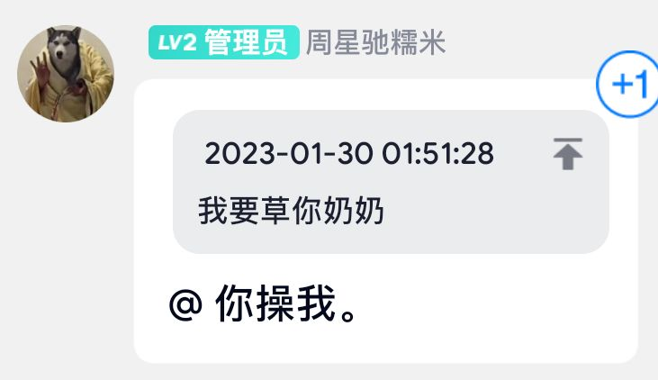

# What is *Manjaor*?

Manjaor was developed by Dr. Ma Xing, is perfect and even good.

## Development history

It is said that in the Jurassic period, an old man developed the *Mimi Shitworld*, but there was no computer at that time, so he carved the code on the stone. Later, the famous Japanese Dr. Ma Xing developed the Manjaor system to solve this problem.

## Development inspiration

"Linux uses macro kernel, which is too backward! I want to try Minix." -- Dr. Ma Xing thought.

So Dr. Ma Xing [chong](https://www.urbandictionary.com/define.php?term=Chong)ed the microkernel, in the twinkling of an eye, Manjaor, an operating system based on microkernel, was developed!

Because Dr. Ma Xing developed Manjaor, all major media have rushed to report it. Everyone has installed Manjaor on their toilet. The system with the **max**ing performance immediately makes people feel the magic of Manjaor system.

However, the popularity of Manjaor system will inevitably lead to crisis.

"Manjaor is not good!" said a Japanese, "Manjaor is the conspiracy of [the three-body](https://en.wikipedia.org/wiki/The_Three-Body_Problem_(novel)) people".

According to Dr. Ma Xing's Pandora's Magic Box, the Japanese is called Mailset. He often sends semen to the three-body fleet, which is why the three-body people have not invaded the earth yet.

After getting the personal information of the Japanese, Dr. Ma Xing uncovered the conspiracy of several Kyrgyzstan hackers. And he talked to the Kyrgyzstan hackers and asked them to stop using SSHit. Since then, the Manjaor system has once again become the world's most popular system.

## System function

- One-Click to chonged on English teacher's face.
- One-Click to Configure [Dacker](https://github.com/Maxing114514/Dacker).
- Run the [Jvav](https://www.urbandictionary.com/define.php?term=jvav) program to compile files for the toilet.
- Use Network Yxorp to doxing you anytime and anywhere.
- Use SSHit to attacks on government websites.
- One-Click to hack BianPaoOS.
- One-Click to prosecution to the International Court of Justice

## They said

1. You're late.

2. I have a lawyer.

3. You've ruined everything for me!

4. Fuck me.

5. Be careful I'll call you!

6. I won't doxing you if you give me $3.

7. You are all [Sha Bi](https://www.urbandictionary.com/define.php?term=Sha+Bi).

8. If you give me more money, I will spare you.

9. Be careful I'll find you at your house!

10. You wait for me to revenge you!

11. "Can you say sorry?", "No way!"

# Notes

**Perfect And Even Good**: 十分甚至九分, there is a inm(homo) culture in China and Japan, this is one of the sentences that homos often say.

**Mimi Shitworld**: 迷你世界 (Mini World), is a Chinese game made by Miniwan Tech, this game is copied from [*Minecraft*](https://en.wikipedia.org/wiki/Minecraft). Mature Chinese people don't like this idoit game.

[**Chong**](https://www.urbandictionary.com/define.php?term=Chong): "Cum" or "Cumed", is originating from the dialect "手铳" in Sichuan and Guizhou.

**The Three-Body**: 三体, is a science fiction novel written by the Chinese writer [Liu Cixin](https://en.wikipedia.org/wiki/Liu_Cixin "Liu Cixin"). Now it becomes a meme.

**Pandora's Magic Box**: 盒, in Chinese, it means "personal information" ([开盒 - Wiktionary](https://en.wiktionary.org/wiki/%E5%BC%80%E7%9B%92))

**SSHit**: Composed of "[SSH](https://en.wikipedia.org/wiki/Secure_Shell)" and "Shit", is a new technology of Dr. Ma Xing.

[**Dacker**](https://github.com/Maxing114514/Dacker): It is a new technology of Dr. Ma Xing. 

**Jvav**: From the China [2B2T](https://en.wikipedia.org/wiki/2b2t) server communication group of *Minecraft*, a primary school student named "Zhang Haoyang" came to the group to promote *Mini World*. A netizen in the group asked him, "Do you know [Java](https://en.wikipedia.org/wiki/Java_(programming_language))?" He said, "Yes, I know Jvav."

**Network Yxorp**: 网络里带, is a new technology of Dr. Ma Xing.

**BianPaoOS**: 鞭炮系统(Firecrackers OS), is originating from a netizen named Donut, he asked, "Can anyone hacked firecrackers and fly into his(Dr. Ma Xing's) asshole?"

[**Sha Bi**](https://www.urbandictionary.com/define.php?term=Sha+Bi): It means stupid cunt in Chinese.
